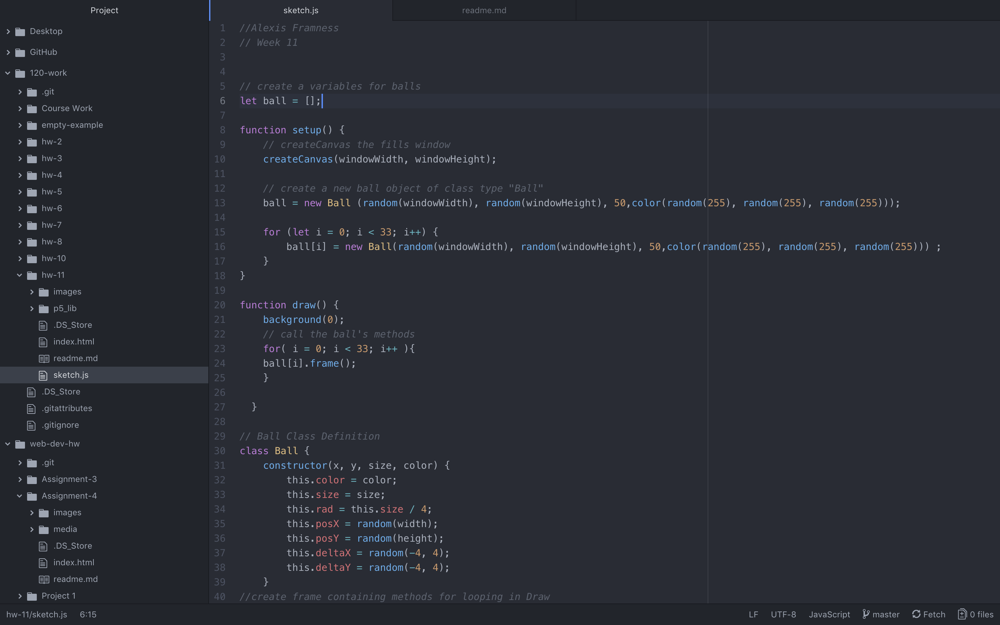

Alexis Framness
Date:11/6/18

# **Week 11 Assignment:** Object Oriented Programming (OOP)

[Balls Abound](https://lexiframness.github.io/120-work/hw-11)

I decided to create a canvas in which there are multiple balls generated, each with their own random color, bouncing around the screen.

I began by creating a canvas, then created a ball which I assigned a class. I then called the class using an Array.

# Problems
I did not run into any problems this week.

#Screenshot of workflow.

