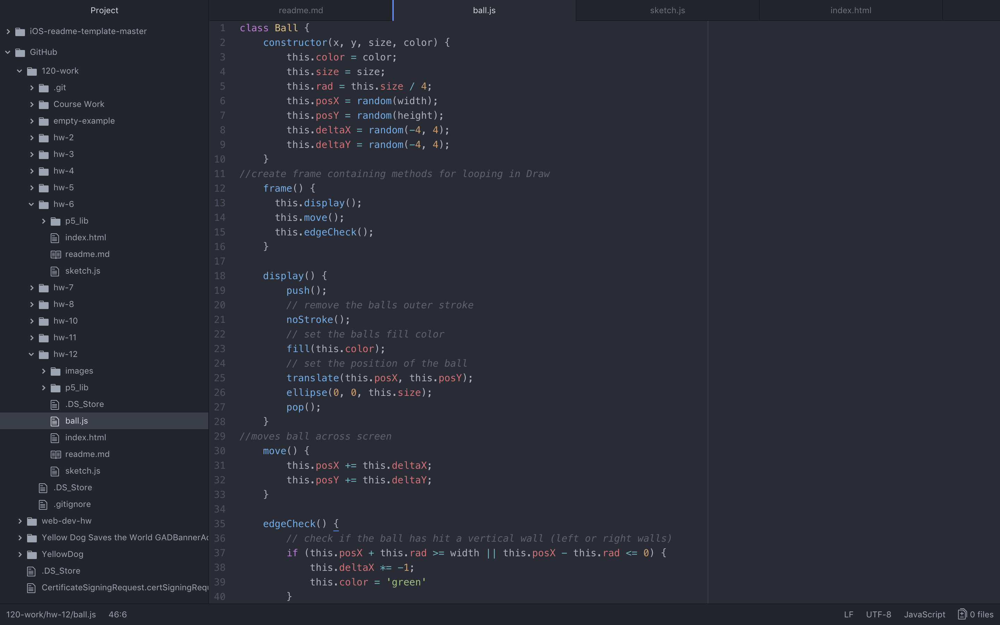

Alexis Framness
Date:11/20/18

# **Week 12 Assignment:** Object Awareness

[Awareness](https://lexiframness.github.io/120-work/hw-12)

I decided to take my code from week 11, and then adjust it accordingly to make it work for the week 12 assignment. I also wanted to split each class out into its own file, so keep my code a little cleaner, and easier to work with.

I began by creating a canvas, then created a ball which I assigned a class. I then called the class using an Array.
I then decided to have the color of the ball change once it has hit an edge of the screen.

# Problems
I did not run into any problems this week.

# Screenshot of workflow.

